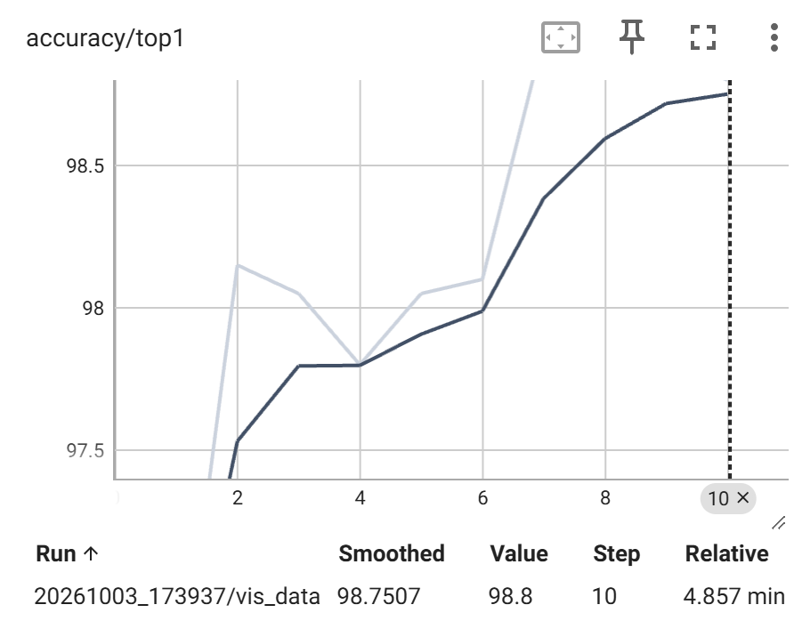
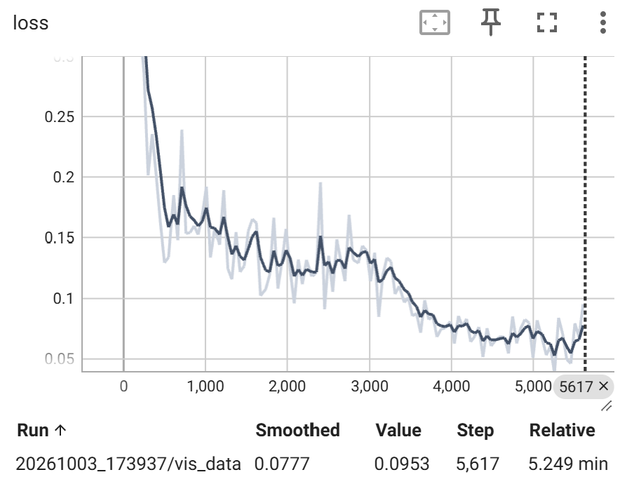
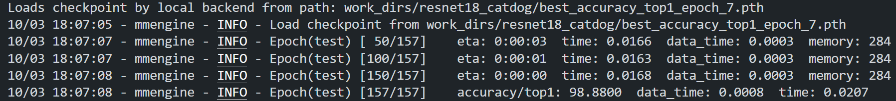
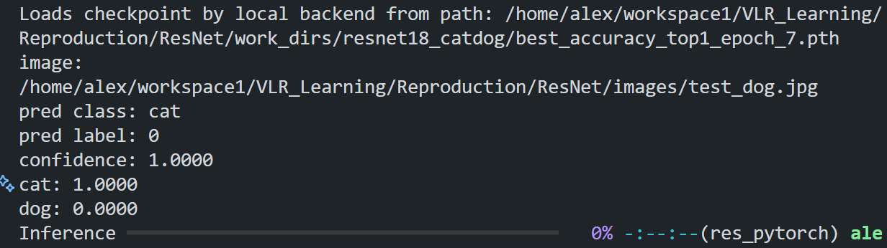

# ResNet复现

基于 MMPretrain 的 ResNet18、ResNet50 迁移学习复现。

参考 MMPretrain 代码框架，分别加载预训练的 ResNet18 和 ResNet50 权重模型，并使用猫狗训练集进行微调。

未集成 SENet 模块；未实现 DDP 多卡训练

## 训练、测试环境

    System: Ubuntu-24.04
    
    RAM: 64GB
    
    GPU：NVIDIA GeForce RTX 5070 Laptop GPU (8 GB)
    
    CUDA Version: 12.8
   
    Python Version: Python 3.10.21
    
    Pytorch Version: torch 2.11.0+cu128  
                     
                     torchaudio 2.11.0+cu128 
                     
                     torchvision 0.26.0+cu128

    mmengine 0.10.7

    mmcv 2.2.0

    mmpretrain 1.2.0

以下第 1 至 8 节为通用环境、数据配置和工具说明，第 9 至 11 节记录 ResNet18，第 12 至 15 节记录 ResNet50。

## 1. 生成MMPretrain格式的数据标注

相关文件：

    ./tools/make_catdog_split.py

在ResNet目录下运行：

`````
python tools/make_catdog_split.py
`````

以生成 train_split.txt 、 val_split.txt 、 test_split.txt ，这三个文件，下一步会分别接到 MMPretrain 的 train_dataloader、val_dataloader 和 test_dataloader 中。

## 2. 数据集配置

相关文件：

    ./configs/_base_/datasets/catdog_bs32.py

检查配置是否被正确解析：

    python -c "from mmengine.config import Config; c=Config.fromfile('configs/_base_/datasets/catdog_bs32.py'); print(c.train_dataloader.dataset.type); print(c.train_dataloader.dataset.ann_file); print(c.test_dataloader.dataset.ann_file)"

预期输出：

    CustomDataset
    
    train_split.txt
    
    test_split.txt

## 3. ResNet18 模型配置

相关文件： 

    ./configs/_base_/models/resnet18_catdog.py

加载 ResNet18 官方预训练权重，只加载 backbone. 开头的卷积层权重，不加载1000类分类头。只取最后一个stage的特征，输出通道数是 512 。

在Resnet目录下运行以下内容检查配置，第一次运行会下载ResNet18的官方预训练权重，大约几十MB。再次运行不会重复下载。

`````
python - <<'PY'
from mmengine.config import Config
from mmpretrain.registry import MODELS

cfg = Config.fromfile('configs/_base_/models/resnet18_catdog.py')
print('model type:', cfg.model.type)
print('backbone depth:', cfg.model.backbone.depth)
print('num classes:', cfg.model.head.num_classes)
print('in channels:', cfg.model.head.in_channels)

model = MODELS.build(cfg.model)
print('model:', model.__class__.__name__)
print('head:', model.head)
PY
`````

## 4. 微调训练调度

相关文件：

    ./configs/_base_/schedules/catdog_finetune.py

使用SGD优化器，初始学习率 0.01 ，计划训练10个epoch，第6轮和第九轮结束时把学习率再乘以 0.1 ，每个epoch之后运行一次验证集，用来记录验证准确率并选择最佳模型。

检查配置能否被解析：

`````
python - <<'PY'
from mmengine.config import Config

cfg = Config.fromfile(
    'configs/_base_/schedules/catdog_finetune.py'
)

print('optimizer:', cfg.optim_wrapper.optimizer.type)
print('lr:', cfg.optim_wrapper.optimizer.lr)
print('max epochs:', cfg.train_cfg.max_epochs)
print('milestones:', cfg.param_scheduler.milestones)
PY
`````

预期输出：

`````
optimizer: SGD
lr: 0.01
max epochs: 10
milestones: [6, 9]
`````

## 5. runtime 和顶层训练配置

相关文件：

    ./configs/_base_/default_runtime.py
    ./configs/resnet18_catdog.py

关键配置：

根据验证集 Top-1 Accuracy 保存最佳模型。

只保留最近的普通 checkpoint，避免 work_dirs 无限增长。最佳 checkpoint 会单独保留。

顶层配置文件：

    ./configs/resnet18_catdog.py

在 ResNet 目录下运行以下代码，检查组合配置：
`````
python - <<'PY'
from mmengine.config import Config

cfg = Config.fromfile('configs/resnet18_catdog.py')

print('backbone:', cfg.model.backbone.type)
print('depth:', cfg.model.backbone.depth)
print('num classes:', cfg.model.head.num_classes)
print('train batch size:', cfg.train_dataloader.batch_size)
print('train annotation:', cfg.train_dataloader.dataset.ann_file)
print('val annotation:', cfg.val_dataloader.dataset.ann_file)
print('test annotation:', cfg.test_dataloader.dataset.ann_file)
print('optimizer:', cfg.optim_wrapper.optimizer.type)
print('learning rate:', cfg.optim_wrapper.optimizer.lr)
print('max epochs:', cfg.train_cfg.max_epochs)
print('work dir:', cfg.work_dir)
print('vis backends:', [x.type for x in cfg.visualizer.vis_backends])
PY
`````
预期输出：
`````
backbone: ResNet
depth: 18
num classes: 2
train batch size: 32
train annotation: train_split.txt
val annotation: val_split.txt
test annotation: test_split.txt
optimizer: SGD
learning rate: 0.01
max epochs: 10
work dir: work_dirs/resnet18_catdog
vis backends: ['LocalVisBackend', 'mmengine.TensorboardVisBackend']
`````

## 6. ResNet18 最简冒烟测试

相关文件：

    ./configs/resnet18_catdog_smoke.py

只训练 5 个 iteration， 5 次参数更新。

不运行验证集，所以不根据验证准确率保存最佳模型。

运行冒烟测试：

    python /home/alex/miniconda3/envs/res_pytorch/lib/python3.10/site-packages/mmpretrain/.mim/tools/train.py \
    configs/resnet18_catdog_smoke.py

第一次运行会下载 ResNet18 ImageNet 预训练权重，文件大约 45 MB，下载后会缓存：

    resnet18_8xb32_in1k_20210831-fbbb1da6.pth

测试生成的产物：
`````
work_dirs/resnet18_catdog_smoke/epoch_1.pth
work_dirs/resnet18_catdog_smoke/last_checkpoint
work_dirs/resnet18_catdog_smoke/resnet18_catdog_smoke.py
work_dirs/resnet18_catdog_smoke/20261003_160521/20261003_160521.log
work_dirs/resnet18_catdog_smoke/20261003_160521/vis_data/scalars.json
work_dirs/resnet18_catdog_smoke/20261003_160521/vis_data/config.py
work_dirs/resnet18_catdog_smoke/20261003_160521/vis_data/events.out.tfevents...
`````

笔记：
`````
1个epoch：
    模型把训练集全部过一遍，一个epoch里有多个iteration
1个iteration：
    每处理一个batch，做一次：
        前向传播 -> 计算 loss -> 反向传播 -> 更新参数
    就是一个iteration，一次迭代
`````

## 7. 项目本地训练、测试入口

相关文件：

    ./tools/train.py
    ./tools/test.py

**注**：这里的 train.py 文件直接由官方 MMPretrain 的训练入口复制而来，命令：

    cp 系统里下载的MMPretrain的train.py路径 tools/train.py

如：

    cp .../python3.10/site-packages/mmpretrain/.mim/tools/train.py tools/train.py

这里的 test.py 由 .../python3.10/site-packages/mmpretrain/.mim/tools/test.py 复制到本地之后，为解决版本兼容问题，在顶部 import 部分做了部分修改，将完整的可信类型一次加入白名单。

检查命令行参数：
`````
python tools/train.py --help
python tools/test.py --help
`````

test.py 用法：
`````
python tools/test.py <配置文件> <checkpoint 文件>
`````
用冒烟测试生成的 epoch_1.pth 验证完整测试链路：
`````
python tools/test.py \
    configs/resnet18_catdog.py \
    work_dirs/resnet18_catdog_smoke/epoch_1.pth \
    --work-dir work_dirs/resnet18_catdog_smoke_test
`````

## 8. 输出单张图片的 cat/dog 类别和置信度模块

相关文件：

    ./tools/infer.py

在ResNet根目录执行，用冒烟 checkpoint 测试单张图片（图片为 ``./images/test_dog.jpg`` ）：
`````
python tools/infer.py \
    images/test_dog.jpg \
    --config configs/resnet18_catdog.py \
    --checkpoint work_dirs/resnet18_catdog_smoke/epoch_1.pth
`````
可加参数 `````--show-dir work_dirs/infer_visualization````` 把预测结果画到原图上，保存一张带文字标注的结果图。位置在 `./work_dirs/infer_visualization/test_dog.png`

## 9. ResNet18 正式训练

启动训练：
`````
python tools/train.py \
    configs/resnet18_catdog.py \
    --work-dir work_dirs/resnet18_catdog \
    2>&1 | tee work_dirs/resnet18_catdog/console.log
`````
使用了完整配置：
`````
训练集：18000 张
验证集：2000 张
测试集：5000 张
epoch：10
batch size：32
优化器：SGD，初始学习率 0.01
最佳模型指标：验证集 accuracy/top1
`````
Tensorboard、日志和 checkpoint 会保存到：`work_dirs/resnet18_catdog/`

训练结束后通常有：
`````
work_dirs/resnet18_catdog/
├── best_accuracy_top1_epoch_X.pth
├── epoch_1.pth
├── epoch_2.pth
├── ...
├── last_checkpoint
├── console.log
└── 2026.../
    └── vis_data/
        ├── config.py
        ├── scalars.json
        └── events.out.tfevents...
`````
其中`best_accuracy_top1_epoch_X.pth`为验证集 Top-1 Accuracy 最高的模型，后续测试和单图推理都使用它。

查看Tensorboard：
`tensorboard --logdir work_dirs/resnet18_catdog --port 6006 --bind_all`
浏览器打开：`http://localhost:6006`可查看训练过程生成的可视化结果。

## 10. ResNet18 测试和推理

检查`./work_dir`目录下的最佳模型文件名，如：`best_accuracy_top1_epoch_7.pth`

**运行测试**：
`````
python tools/test.py \
    configs/resnet18_catdog.py \
    work_dirs/resnet18_catdog/best_accuracy_top1_epoch_7.pth \
    --work-dir work_dirs/resnet18_catdog_final_test
`````
最后输出的`accuracy/top1:`为模型在5000张测试图片上的表现

**单张图片推理**：
`````
python tools/infer.py \
    images/test_dog.jpg \
    --config configs/resnet18_catdog.py \
    --checkpoint work_dirs/resnet18_catdog/best_accuracy_top1_epoch_7.pth \ #注意这里为最佳模型名
    --show-dir work_dirs/infer_visualization
`````

## 11. ResNet18 测试、推理记录

`````
模型：ResNet18
预训练权重：ImageNet 1K
数据：18000 train / 2000 val / 5000 test
epoch：10
batch size：32
优化器：SGD
初始学习率：0.01
最佳 epoch：7
best val accuracy：98.95%
final test accuracy：98.88%
`````

即微调后最终准确率为 98.88%

训练过程可视化如图，其他更多图片记录在 `process_record/TensorBoard/`：



测试输出如图：


单张推理输出如图：


## 12. ResNet50 模型配置

相关文件：

    ./configs/_base_/models/resnet50_catdog.py
    ./configs/resnet50_catdog.py

ResNet50 与 ResNet18 使用相同的数据集、训练调度和运行配置，主要区别如下：

    depth: 50
    最后阶段输出通道数: 2048
    分类头输入通道数: 2048
    预训练权重：resnet50_8xb32_in1k_20210831-ea4938fc.pth
    work_dir: work_dirs/resnet50_catdog

## 13. ResNet50 正式训练

启动训练：
`````
python tools/train.py \
    configs/resnet50_catdog.py \
    --work-dir work_dirs/resnet50_catdog
`````

训练使用完整配置：
`````
训练集：18000 张
验证集：2000 张
测试集：5000 张
epoch：10
batch size：32
优化器：SGD，初始学习率 0.01
最佳模型指标：验证集 accuracy/top1
`````

训练日志和 checkpoint 保存在：

    work_dirs/resnet50_catdog/

最佳 checkpoint：

    work_dirs/resnet50_catdog/best_accuracy_top1_epoch_8.pth

## 14. ResNet50 测试和推理

**运行测试**：
`````
python tools/test.py \
    configs/resnet50_catdog.py \
    work_dirs/resnet50_catdog/best_accuracy_top1_epoch_8.pth \
    --work-dir work_dirs/resnet50_catdog_final_test
`````

最后输出的 `accuracy/top1:` 为模型在 5000 张测试图片上的表现。

**单张图片推理**：
`````
python tools/infer.py \
    images/test_dog.jpg \
    --config configs/resnet50_catdog.py \
    --checkpoint work_dirs/resnet50_catdog/best_accuracy_top1_epoch_8.pth \
    --show-dir work_dirs/infer_visualization_resnet50
`````

## 15. ResNet50 测试、推理记录

`````
模型：ResNet50
预训练权重：ImageNet 1K
数据：18000 train / 2000 val / 5000 test
epoch：10
batch size：32
优化器：SGD
初始学习率：0.01
最佳 epoch：8
best val accuracy：99.10%
final test accuracy：99.10%
`````

即 ResNet50 微调后最终测试准确率为 99.10%。
